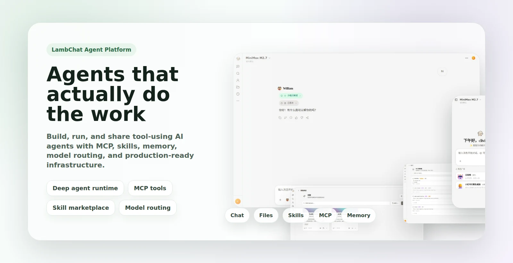

<div align="center">

# 🐑 LambChat

**一个开源 AI Agent 平台，用来构建、运行并分享真正能把事情做完的智能体**

[]()
[]()
[]()
[]()
[]()
[]()
[](LICENSE)

[English](README.md) · [简体中文](README_CN.md) · [文档](https://yanyutin753.github.io/LambChat/zh/) · [参与贡献](CONTRIBUTING.md)

<br>



</div>

---

## 🌟 为什么选择 LambChat

LambChat 不只是一个聊天界面，而是一整套可落地的 AI Agent 系统。它把模型管理、MCP 接入、技能系统、文件存储、分享机制、人工审批，以及生产可用的前后端基础设施整合进了一个项目里。

| Agent 运行时 | 工具与 MCP | 技能与记忆 | 生产基础设施 |
|---|---|---|---|
| Deep agent 图运行时、流式输出、子 Agent、思考模式和人工审批。 | 系统级/用户级 MCP、密钥加密、工具缓存、上传/揭示工具和沙箱执行。 | 技能市场、GitHub 同步、人格预设、模型路由和 MongoDB 记忆。 | FastAPI、React 19、鉴权/RBAC、链路追踪、健康检查、存储、实时同步和部署资源。 |

## 📸 产品预览

| 对话与执行 | 技能市场 | 运维控制台 |
|:---:|:---:|:---:|
| <br>**流式 Agent 工作流** | <br>**可复用技能** | <br>**MCP 与工具** |
| <br>**富文件库** | <br>**模型路由** | <br>**响应式界面** |

<details>
<summary><b>查看完整界面图库</b></summary>

| | | |
|:---:|:---:|:---:|
| <br>**登录** | <br>**注册** | <br>**重置密码** |
| <br>**邮箱验证** | <br>**注册待审核** | <br>**聊天** |
| <br>**流式输出** | <br>**分享** | <br>**技能** |
| <br>**技能市场** | <br>**MCP 配置** | <br>**智能体** |
| <br>**模型** | <br>**渠道** | <br>**文件** |
| <br>**人格** | <br>**记忆** | <br>**通知** |
| <br>**系统设置** | <br>**反馈** | <br>**会话分享** |
| <br>**角色管理** | <br>**用户管理** | <br>**平板端** |

</details>

## 🎬 实战案例

| # | 案例 | 说明 | 演示 |
|---|------|------|------|
| 1 | 供应链效率分析 PDF 报告 | 从一句需求出发，自动生成图表、基准对比和完整交付物，输出可直接使用的供应链效率分析 PDF 报告。 | [查看会话](https://lambchat.com/shared/w0WA7GtMCyca) |
| 2 | 教父三部曲主题英文网站 | 自动搭建面向影迷的英文专题网页，包含电影感视觉风格、跑马灯 Hero、生成图片和多端适配。 | [查看会话](https://lambchat.com/shared/9XlmaDANCjO9) |
| 3 | 图片内容故事全解 | 基于图片进行多模态理解，识别其中包含的故事，并输出逐个展开的详细剧情讲解。 | [查看会话](https://lambchat.com/shared/MZX-eNnOoilN) |
| 4 | 新能源汽车市场趋势分析 | 基于 2025-2026 最新数据整理结构化市场洞察，覆盖增长趋势、区域表现和行业关键信号。 | [查看会话](https://lambchat.com/shared/5XUeuDEyd2CY) |
| 5 | 🎮 一键批量生成 48 个游戏 UI 素材 | 只需喂一张参考图，Agent 自动分析美术风格，一口气生成 **48 个游戏 UI Icon**，按 9 个类别（糖果、按钮、标签、货币、角色、技能、导航、边框、特殊）自动分好文件夹打包，还能把整个流程沉淀成一个**可复用技能**，下次直接调用。 | [查看会话](https://lambchat.com/shared/BFkDxT2J4pR0) |
| 6 | 🥧 榴莲电商全自动组图 | 输入商品关键词（如"榴莲"）和目标平台（淘宝/京东/拼多多），Agent 自动完成：人群分析 → 视觉策略 → 主图、生活场景图、细节图、搭配图一键生成，一整套电商视觉素材全自动搞定。 | [查看会话](https://lambchat.com/shared/Hx8mPq3R5nW1) |

## 🏗️ 系统架构

<p align="center"></p>

## ✨ 核心特性

<details>
<summary><b>🤖 Agent 运行时</b></summary>

- **deepagents 架构** — 编译图运行时，支持细粒度状态管理
- **多 Agent 类型** — 核心、快速、搜索 Agent
- **插件系统** — 通过 `@register_agent("id")` 注册自定义 Agent
- **流式输出** — 原生 SSE 支持
- **子 Agent** — 多层级委派
- **思考模式** — 支持 Anthropic 扩展思考
- **人工审批** — 带倒计时、自动延期和紧急状态样式的审批系统
- **人格预设** — 支持可复用的人格配置、权限控制和运行时绑定

</details>

<details>
<summary><b>🧠 模型、记忆与技能</b></summary>

- **多模型供应商** — OpenAI、Anthropic、Google Gemini、Kimi
- **完整 CRUD** — 通过 UI 创建、编辑、删除、排序和批量导入模型
- **渠道路由** — 同一模型可通过 `model_id` 在不同渠道复用
- **角色权限** — `MODEL_ADMIN` 权限和按角色控制模型可见性
- **跨会话记忆** — 原生 MongoDB 记忆后端
- **技能双存储** — 文件系统 + MongoDB 备份
- **GitHub 同步** — 从 GitHub 导入自定义技能
- **技能市场** — 浏览、安装、发布以及批量管理技能

</details>

<details>
<summary><b>🔌 工具、MCP 与执行能力</b></summary>

- **系统级 + 用户级 MCP** — 支持全局和个人 MCP 配置
- **加密存储** — API Key 静态加密存储
- **动态工具缓存** — MCP 工具缓存与手动刷新
- **多种传输协议** — SSE 和 HTTP
- **权限控制** — 传输层级的访问控制
- **沙箱集成** — 支持 Daytona 和 E2B
- **内置工具** — 文件揭示、项目揭示、上传 URL、环境变量、音频转写、人格预设工具等

</details>

<details>
<summary><b>📁 产品功能</b></summary>

- **文件库** — 浏览已揭示文件，支持代码预览、收藏和项目级筛选
- **丰富预览** — PDF、Word、Excel、PPT、Markdown、Mermaid、Excalidraw、图片和视频播放
- **项目文件夹** — 通过拖拽管理会话归属
- **会话分享** — 一键生成公开分享链接
- **反馈系统** — 点赞评分、文字评论、会话关联和运行级统计
- **通知能力** — 内置站内通知存储和分发能力

</details>

<details>
<summary><b>🔐 基础设施、实时能力与前端</b></summary>

- **实时同步** — Redis + MongoDB 双写、WebSocket、自动重连和分享页实时更新
- **安全** — JWT、RBAC、bcrypt、OAuth（Google/GitHub/Apple）、邮箱验证、验证码和沙箱控制
- **可观测性** — LangSmith 链路追踪、结构化日志、健康检查和分布式内存诊断
- **渠道系统** — 原生飞书集成，并支持可扩展的多渠道架构
- **前端栈** — React 19、Vite 6、TailwindCSS 3.4，支持深浅主题、富内容渲染和多端响应式布局
- **国际化** — 英文、中文、日文、韩文、俄文

</details>

## ⚙️ 配置说明

支持多个设置分类，可通过 UI 或环境变量配置：

| 分类 | 说明 |
|------|------|
| 前端 | 默认 Agent、欢迎建议、UI 偏好 |
| Agent | 调试模式、日志级别 |
| 模型 | 多供应商模型管理、每模型独立配置、渠道路由 |
| 会话 | 会话管理、消息历史、SSE 缓存 |
| 数据库 | MongoDB 连接，可选 PostgreSQL |
| 存储 | 持久化存储、S3/OSS/MinIO/COS |
| 安全 | 加密与安全策略 |
| 沙箱 | 代码沙箱设置（Daytona / E2B） |
| 技能 | 技能系统配置 |
| 工具 | 工具系统设置 |
| 追踪 | LangSmith 链路追踪 |
| 用户 | 用户管理、注册、默认角色 |
| 记忆 | 记忆系统（native） |

## 🚀 快速开始

### 环境要求

- Python 3.12+ · Node.js 18+ · pnpm · MongoDB · Redis

### 安装

```bash
git clone https://github.com/Yanyutin753/LambChat.git
cd LambChat

# Docker 启动（推荐）
cd deploy && cp .env.example .env   # 编辑填写配置
docker compose up -d

# 或本地运行
cp .env.example .env   # 编辑填写配置
make install-pnpm      # 安装 pnpm（如未安装）
make install && make dev
```

<details>
<summary><b>📝 必填配置</b></summary>

编辑 `.env` 文件，填写以下推荐配置：

```bash
# 推荐：设置稳定的 JWT 密钥（不设置则每次重启自动生成，导致已登录用户失效）
JWT_SECRET_KEY=your-stable-secret-key

# 推荐：设置 MCP 加密盐值（不设置则每次重启自动生成，导致已保存的 MCP 配置失效）
MCP_ENCRYPTION_SALT=your-stable-encryption-salt

# 可选：配置 MongoDB 连接
MONGODB_URL=mongodb://localhost:27017
MONGODB_DB=agent_state
MONGODB_USERNAME=admin
MONGODB_PASSWORD=your-mongo-password

# 可选：配置 Redis 连接
REDIS_URL=redis://localhost:6379/0
REDIS_PASSWORD=your-redis-password
```

::: tip
LLM 模型通过部署后的 **模型配置 UI** 添加，无需在环境变量中配置。
:::

</details>

打开 **http://localhost:8000**

### 代码质量

```bash
make format       # 格式化 (ruff format)
make lint         # 检查风格 (ruff check)
make typecheck    # 类型检查 (mypy)
make check-all    # 运行所有检查 (lint + typecheck + test)
```

### 项目结构

```text
src/
├── agents/         # Agent 实现与运行时图
├── api/            # FastAPI 路由、管理接口、中间件
├── infra/          # 认证、llm、mcp、工具、存储、任务、分享、记忆等核心服务
├── kernel/         # Schema、配置、常量与共享类型
└── skills/         # 内置技能
frontend/
├── src/components/ # UI 组件、面板、落地页模块
├── src/hooks/      # 前端 hooks
├── src/i18n/       # 多语言文案
└── src/styles/     # 共享样式与设计变量
tests/              # 后端与集成测试
deploy/             # Docker 部署资源
```

## ⭐ Star History

<a href="https://star-history.com/#Yanyutin753/LambChat&Date">
 <picture>
   <source media="(prefers-color-scheme: dark)" srcset="https://api.star-history.com/svg?repos=Yanyutin753/LambChat&type=Date&theme=dark" />
   <source media="(prefers-color-scheme: light)" srcset="https://api.star-history.com/svg?repos=Yanyutin753/LambChat&type=Date" />
   
 </picture>
</a>

## 📄 许可证

[MIT](LICENSE) — 项目名称 "LambChat" 及其标志不得被更改或移除。

---

<div align="center">

<sub><strong>LambChat</strong> 想做的，不只是能聊天的 AI，而是真正能把事情做完的 Agent。</sub>

<br>

<strong>Created by <a href="https://github.com/Yanyutin753">Clivia</a></strong>

<br>

<a href="https://github.com/Yanyutin753">GitHub</a> · <a href="mailto:3254822118@qq.com">邮箱</a> · <a href="README.md">English README</a>

<br><br>


<br>

<sub>欢迎交流部署、产品想法和合作，添加时备注 <strong>LambChat</strong></sub>

</div>
